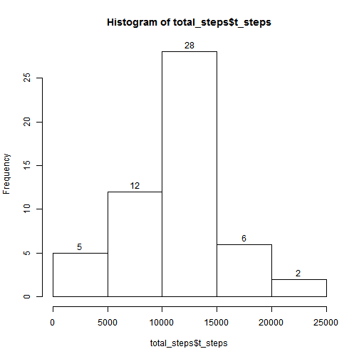
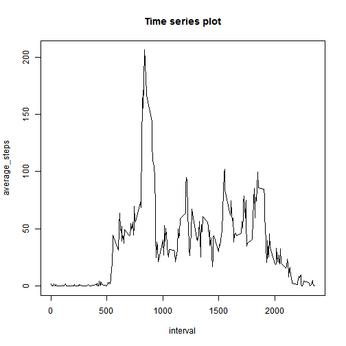
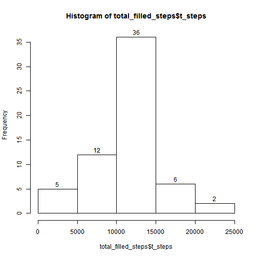
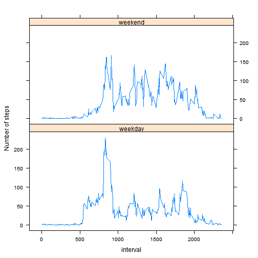

# Reproducible Research: Peer Assessment 1


## Loading and preprocessing the data

```r
data <- read.csv("activity.csv")
complete_data <- na.omit(data)
```

Load the library to be used later.

```r
library(plyr)
library(lattice)
```


## What is mean total number of steps taken per day?
1.Make a histogram of the total number of steps taken each day.

```r
total_steps <- ddply(complete_data, .(date), summarize, t_steps = sum(steps))
hist(total_steps$t_steps, labels = TRUE)
```

 


2.Calculate and report the mean and median total number of steps taken per day.

```r
mean_steps <- mean(total_steps$t_steps)
median_steps <- median(total_steps$t_steps)
```

After excluding the NAs, the mean and median total number of steps taken per day are 1.0766 &times; 10<sup>4</sup> and 10765 respectively.

## What is the average daily activity pattern?
1.Make a time series plot (i.e. type = "l") of the 5-minute interval (x-axis) and the average number of steps taken, averaged across all days (y-axis).

```r
ave_steps <- ddply(complete_data, .(interval), summarize, average_steps = mean(steps))
plot(ave_steps, type = "l", main = "Time series plot")
```

 

2.Which 5-minute interval, on average across all the days in the dataset, contains the maximum number of steps?

```r
max_step <- ave_steps[which.max(ave_steps$average_steps), 1]
```

Interval 835 contains the maximum number of steps.

## Imputing missing values
1.Calculate and report the total number of missing values in the dataset (i.e. the total number of rows with NAs)

```r
na_num <- sum(is.na(data))
```

Total 2304 rows with NAs. 

2.Devise a strategy for filling in all of the missing values in the dataset. The strategy does not need to be sophisticated. For example, you could use the mean/median for that day, or the mean for that 5-minute interval, etc.  

The strategy to be used is to find out the interval relevant to the NA and replace the NA with the mean of number of steps taken corresponding to that interval(averaged across days).  
The mean has been calculated and stored in the data frame "ave_steps" in the previous question. We can use it here.  

3.Create a new dataset that is equal to the original dataset but with the missing data filled in.  

The new dataset is called "filled_data". The code for filling in the missing data:

```r
filled_data <- data
indicator <- is.na(filled_data$steps)
filled_data$steps[indicator] <- ave_steps$average_steps[match(filled_data$interval[indicator], 
    ave_steps$interval)]
```


4.Make a histogram of the total number of steps taken each day and Calculate and report the mean and median total number of steps taken per day. Do these values differ from the estimates from the first part of the assignment? What is the impact of imputing missing data on the estimates of the total daily number of steps?

```r
total_filled_steps <- ddply(filled_data, .(date), summarize, t_steps = sum(steps))
hist(total_filled_steps$t_steps, labels = TRUE)
```

 

```r
mean_filled_steps <- mean(total_filled_steps$t_steps)
median_filled_steps <- median(total_filled_steps$t_steps)
```

After filling the NAs, the mean and median total number of steps taken per day are 1.0766 &times; 10<sup>4</sup> and 1.0766 &times; 10<sup>4</sup> respectively.  
The mean is the same as the one calculated when omiting the NAs. Filling the NAs has no impact on the the mean of the total daily number of steps.  
The median is slightly bigger than the one calculated when omiting the NAs. Filling the NAs has little impact on the the median of the total daily number of steps.

## Are there differences in activity patterns between weekdays and weekends?
1.Create a new factor variable in the dataset with two levels - "weekday" and "weekend" indicating whether a given date is a weekday or weekend day.

```r
date <- as.Date(filled_data$date)
filled_data$week[weekdays(date) %in% c("Saturday", "Sunday")] = "weekend"
filled_data$week[!(weekdays(date) %in% c("Saturday", "Sunday"))] = "weekday"
filled_data$week <- as.factor(filled_data$week)
```

2.Make a panel plot containing a time series plot (i.e. type = "l") of the 5-minute interval (x-axis) and the average number of steps taken, averaged across all weekday days or weekend days (y-axis). 

```r
ave_steps_week <- ddply(filled_data, .(week, interval), summarize, ave_steps = mean(steps))
xyplot(ave_steps ~ interval | week, data = ave_steps_week, type = "l", layout = c(1, 
    2), ylab = "Number of steps")
```

 


